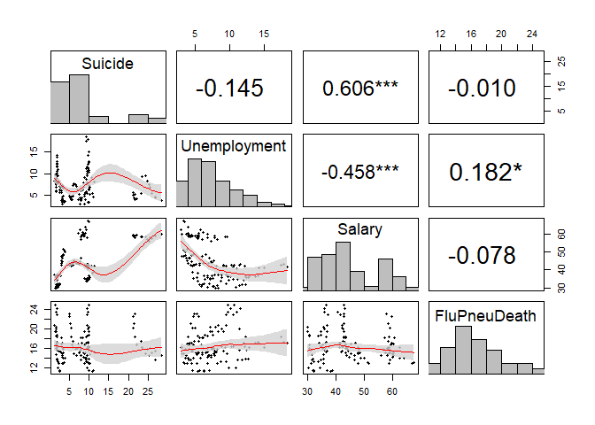
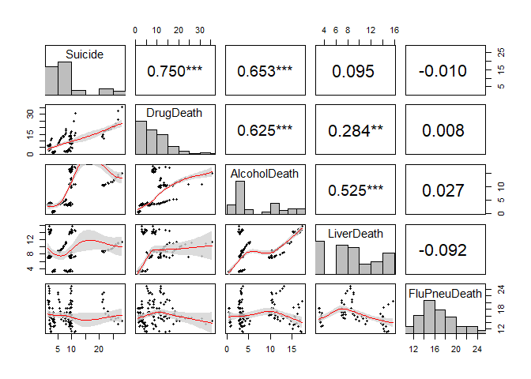
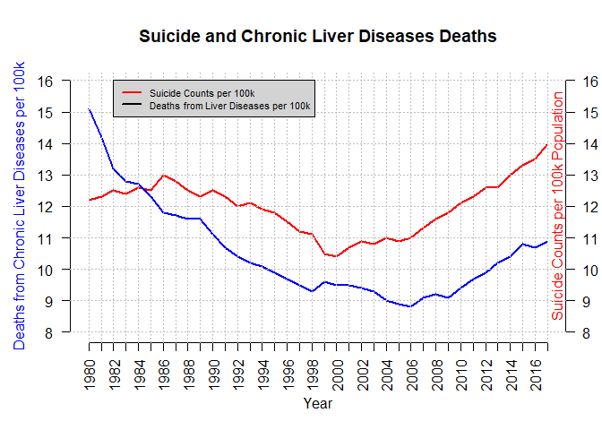

Exploratory Analysis
================

## \_\_\_\_\_\_\_\_\_\_PREPARATION\_\_\_\_\_\_\_\_\_\_

### Data subsetting and cleaning

``` r
dataov = dataov %>%
  rename(Suicide = `Suicide Rate`, Unemployment = `Unemployment Rate`, 
         RespDeath = `Chronic Lower Resp. Disesases (Deaths)`,
         HeartDeath = `Heart Diseases (Deaths)`, 
         LiverDeath = `Chronic liver disease and cirrhosis (Deaths)`,
         CerebroDeath = `Cerebrovascular diseases (Deaths)`)
```

``` r
data = na.omit(data)
```

``` r
#Converting data units
data$Salary = as.numeric(data$Salary/1000)
data$Bankruptcy = as.numeric(data$Bankruptcy/1000)
```

### Explanation of variables

\_\_\_\_\_data\_\_\_\_\_

-   1.  Suicide: suicide counts per 100,000 resident population (1950,
        1960, 1970, 1980-2017, age-adjusted/crude) \[age group, gender X
        age group, gender X race X age group\]

-   2.  Unemployment: unemployment rate > age 16 (1995-1999, 2001-2019,
        thousands/rate) \[age group x gender x race\]

-   3.  Salary: median annual earnings of full-time workers > age 15
        (1960-2017) \[gender, gender X race\]

-   4.  DrugDeath: drug-induced deaths per 100,000 resident population
        (1999-2017, age-adjusted/crude, drug type) \[age group, gender X
        age group, gender X race\]d

-   5.  AlcoholDeath: alcohol-induced deaths per 100,000 resident
        population (1999-2017, age-adjusted) \[gender X race\]

-   6.  RespDeath, HeartDeath, LiverDeath, CerebroDeath: rate of disease
        deaths per 100,000 resident population (1950, 1960, 1970,
        1980-2017, disease type) \[gender, race\]

-   7.  Poverty: percentage of age group below poverty (various periods)
        \[age group x race\]

-   8.  Bankrupt: annual counts of business and non‐business filings by
        year (1980‐2019)

-   9.  Firearms: counts of firearms background checks initiated through
        the NICS (Monthly, November 1998 to May 31, 2020)

-   Mortality data is used to proxy the severeness of that condition in
    the country

-   With the gender and race dimension, available data decreases from
    dataov.

\_\_\_\_\_dataov\_\_\_\_\_ \* a) Unemployment Rate: annual (aggregate)
1980-2017 \* b) Suicide Rate: annual (aggregate) 1980-2017

### Sources

-   (1,4, b) Retrieved: <https://www.cdc.gov/nchs/hus/contents2018.htm>
    (tables 009, 008, 009)

-   2.  Retrieved: <https://www.bls.gov/cps/cps_aa2003.htm> (2003-2017)
        “24-Unemployed persons by marital status, race, Hispanic or
        Latino ethnicity, age, and sex”

-   3.  Retrieved:
        <https://www.dol.gov/agencies/wb/data/earnings#COLLAPSE-earnings-by-sex-race-hispanic-ethnicity>

-   5.  Retrieved:
        <https://www.cdc.gov/nchs/data/nvsr/nvsr68/nvsr68_09_tables-508.pdf>
        (table I-2 (3))

-   6.  Retrieved:
        <https://www.cdc.gov/nchs/hus/contents2018.htm#Table_005>

-   7.  Retrieved
        <https://www.census.gov/data/tables/time-series/demo/income-poverty/historical-poverty-people.html>
        (table 3)

-   8.  Retrieved
        <https://www.abi.org/newsroom/bankruptcy-statistics?page=28>
        (Annual Business and Non‐business Filings by Year (1980‐2019)

-   1.  Retrieved:
        <https://data.bls.gov/timeseries/LNU04000000?periods=Annual+Data&periods_option=specific_periods&years_option=all_years>

## \_\_\_\_\_\_\_\_\_\_DESCRIPTIVE STATISTICS\_\_\_\_\_\_\_\_\_\_

### Pair-wise correlation plots: DATAOV

``` r
pairs.panels(dataov[,c("Suicide", "HeartDeath", "CerebroDeath", "RespDeath", "LiverDeath")], 
             method = "pearson", density = FALSE, ellipses = FALSE, scale = FALSE,
             rug = FALSE, ci = TRUE, stars = TRUE, hist.col = "GREY", digits = 3, cex = 0.85)
```

<!-- -->

### Pair-wise correlation plots: DATA

``` r
corplotdata = data
#[data$Gender == "Female" & data$Race == "White",]
```

png(“GLMM - Correlation Plot 1.png”, units=“in”, width=7, height=5,
res=1080) dev.off()

``` r
pairs.panels(corplotdata[,c("Suicide", "Unemployment", "Salary", "FluPneuDeath")], 
             method = "pearson", density = FALSE, ellipses = FALSE, scale = FALSE,
             rug = FALSE, ci = TRUE, stars = TRUE, hist.col = "GREY", digits = 3, cex = 0.85)
```

<!-- -->

``` r
pairs.panels(corplotdata[,c("Suicide", "DrugDeath", "AlcoholDeath", "LiverDeath",
                            "FluPneuDeath")], 
             method = "pearson", density = FALSE, ellipses = FALSE, scale = FALSE,
             rug = FALSE, ci = TRUE, stars = TRUE, hist.col = "GREY", digits = 3, cex = 0.85)
```

<!-- -->

-   Diagonal shows frequency histogram. Upper matrix shows Pearson
    correlation values. Lower matrix shows scatter plots with best-fit
    lines a 95% CI.

-   Highly significant and strong positive correlation between suicide
    rate and covariates DrugDeath and AlcoholDeath, indicative of high
    explanatory power of these two variables. This is expected, as
    alcoholism and drug abuse can induce suicidal thoughts.

-   Insignificant correlation between suicide rate and unemployment
    rate. Since unemployment rate is used as a measure of the state of
    the economy, this is indication that financial crises do not impact
    suicide rates directly. But may still impact through other
    variables.

-   Significant positive correlation between suicide rate and salary,
    which is counter-intuitive.

-   Insignificant correlation between unemployment rate and
    DrugDeath/AlcoholDeath. Unemployment might be affecting suicide
    through other variables than these.

### Time series plot 1

png(“OV - Suicide and Unemployment.png”, units=“in”, width=7, height=5,
res=1080) dev.off()

``` r
plot(x = dataov$Year, y = dataov$Suicide, 
     type = "l", col = "DARKRED", axes = FALSE, ylim = c(4,16),
     main = "Suicide and Unemployment", 
     xlab = "Year", ylab = "", lwd =2)
lines(x = dataov$Year, y = dataov$Unemployment,
      type = "l", col = "DARKBLUE", lwd = 2)

axis(side = 1, at = 1980:2017, las = 1, cex = 0.5)
axis(side = 2, at = 4:16, las = 2)
mtext("Unemployment Rate (%)", side = 2, line = 2.5, col = "DARKBLUE")
axis(side = 4, at = 4:16, las = 2)
mtext("Suicide Counts per 100k Population", side = 4, line = -1, col = "DARKRED")

abline(h = 4:16, v = 1980:2017, col = "GREY", lty = "dotted")
legend(x = 1980, y = 16, legend = c("Suicide Counts per 100k", "Unemployment Rate"),
       col = c("RED", "BLACK"), lty = 1, lwd = 2, cex = 0.7, bg = "LIGHTGREY")

year1 = 2001; rate1 = dataov$Suicide[dataov$Year == year1]
segments(x0 = year1, y0 = 0, x1 = year1, y1 = rate1, lty = 2)
legend(x = year1, y = rate1-1.5, legend = "Dotcom Bubble", cex = 0.6)

year2 = 2008; rate2 = dataov$Suicide[dataov$Year == year2]
segments(x0 = year2, y0 = 0, x1 = year2, y1 = rate2, lty = 2)
legend(x = year2, y = rate2-0.5, legend = "2008 Crisis", cex = 0.6)

year3 = 1989; rate3 = dataov$Suicide[dataov$Year == year3]
segments(x0 = year3, y0 = 0, x1 = year3, y1 = rate3, lty = 2)
legend(x = year3, y = rate3-2, legend = "Savings and Loan Crisis", cex = 0.6)
```

<!-- -->

### Time series plot 2

``` r
plot(x = dataov$Year, y = dataov$Suicide, 
     type = "l", col = "RED", axes = FALSE, ylim = c(8,16),
     main = "Suicide and Chronic Liver Diseases Deaths", 
     xlab = "Year", ylab = "", lwd =2)
lines(x = dataov$Year, y = dataov$LiverDeath,
      type = "l", col = "BLUE", lwd = 2)

axis(side = 1, at = 1980:2017, las = 2)
axis(side = 2, at = 8:16, las = 2)
mtext("Deaths from Chronic Liver Diseases per 100k", side = 2, line = 2.5, col = "BLUE")
axis(side = 4, at = 8:16, las = 2)
mtext("Suicide Counts per 100k Population", side = 4, line = -1, col = "RED")

abline(h = 4:16, v = 1980:2017, col = "GREY", lty = "dotted")
legend(x = 1982, y = 16, legend = c("Suicide Counts per 100k", "Deaths from Liver Diseases per 100k"),
       col = c("RED", "BLACK"), lty = 1, lwd = 2, cex = 0.7, bg = "LIGHTGREY")
```

<!-- -->

-   Clear rise in unemployment rate after 2008. However, such spikes are
    not observed in suicide trends, indicating unemployment rate does
    not explain suicide rates well.
