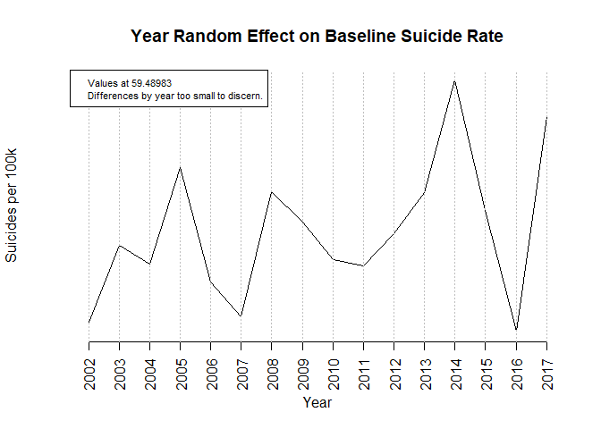
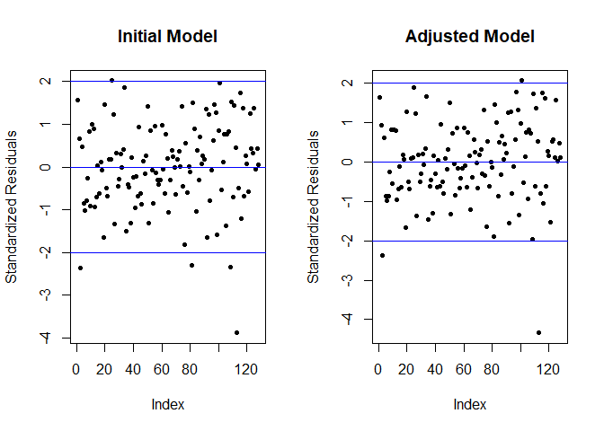
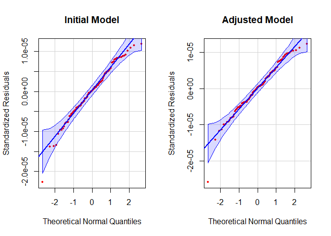

Generalized Linear Mixed Model
================

### Resources

-   <https://mran.microsoft.com/snapshot/2017-04-22/web/packages/sjPlot/vignettes/sjplmer.html>
-   <https://cran.r-project.org/web/packages/glmmTMB/vignettes/model_evaluation.pdf>
-   <https://bbolker.github.io/mixedmodels-misc/ecostats_chap.html>

## \_\_\_\_\_\_\_\_\_\_PREPARATION\_\_\_\_\_\_\_\_\_\_

### Data subsetting and cleaning

``` r
colnames(data)
```

    ##  [1] "Year"                                      
    ##  [2] "Gender"                                    
    ##  [3] "Race"                                      
    ##  [4] "Suicide Rate"                              
    ##  [5] "Diseases of heart"                         
    ##  [6] "Cerebrovascular diseases"                  
    ##  [7] "Malignant neoplasms"                       
    ##  [8] "Chronic lower respiratory diseases"        
    ##  [9] "Influenza and pneumonia"                   
    ## [10] "Chronic liver disease and cirrhosis"       
    ## [11] "Diabetes mellitus"                         
    ## [12] "Human immunodeficiency virus (HIV) disease"
    ## [13] "Homicide"                                  
    ## [14] "Alcohol-induced Deaths"                    
    ## [15] "Drug overdose death rate"                  
    ## [16] "Median Annual Earnings"                    
    ## [17] "Percentage Below Poverty"                  
    ## [18] "Non-Business Bankruptcy Filings"           
    ## [19] "Economic Policy Uncertainty Index"         
    ## [20] "Unemployment Rate"                         
    ## [21] "NICS Background Check"

``` r
data = na.omit(data)
```

``` r
#Converting data units
data$Salary = as.numeric(data$Salary/1000)
data$Bankruptcy = as.numeric(data$Bankruptcy/1000)
```

``` r
colnames(data)
```

    ##  [1] "Year"             "Gender"           "Race"             "Suicide"         
    ##  [5] "HeartDeath"       "CerebroDeath"     "MalNeoplasmDeath" "RespDeath"       
    ##  [9] "FluPneuDeath"     "LiverDeath"       "DiabDeath"        "HIVDeath"        
    ## [13] "HomicideDeath"    "AlcoholDeath"     "DrugDeath"        "Salary"          
    ## [17] "Poverty"          "Bankruptcy"       "Uncertainty"      "Unemployment"    
    ## [21] "Firearms"

## \_\_\_\_\_\_\_\_\_\_FIRST MODEL FIT\_\_\_\_\_\_\_\_\_\_

### Model Specification

-   Interaction term captures any heterogenous impacts of unemployment
    and salary on suicide rates by race (answers the question “is an
    ethnic group more mentally vulnerable to shocks in unemployment or
    salary?”)

-   Year random effects captures any residual shocks or effects not
    explained by covariates within a year (i.e. year 2008 should have a
    higher shock on suicide rate)

### Initial Model Estimation

``` r
#Formatting response matrix for glmm model
#col1 = positive cases, col2 = negative cases (normalized out of 1,000,000)
y = cbind(data$Suicide*10, 1000000-data$Suicide*10)

#Relevelling factors so that baseline group refers to white males
data$Race = relevel(as.factor(data$Race), ref = "White")
data$Gender = relevel(as.factor(data$Gender), ref = "Male")
```

``` r
model = glmmTMB(y ~ Gender + AlcoholDeath + DrugDeath + 
                  FluPneuDeath + LiverDeath +
                  Unemployment:Race + Salary:Race + Poverty + Uncertainty +
                  (1|Year),
               data=data, family=binomial(link='logit'))

summary(model)
```

    ##  Family: binomial  ( logit )
    ## Formula:          
    ## y ~ Gender + AlcoholDeath + DrugDeath + FluPneuDeath + LiverDeath +  
    ##     Unemployment:Race + Salary:Race + Poverty + Uncertainty +      (1 | Year)
    ## Data: data
    ## 
    ##      AIC      BIC   logLik deviance df.resid 
    ##    851.7    900.2   -408.9    817.7      111 
    ## 
    ## Random effects:
    ## 
    ## Conditional model:
    ##  Groups Name        Variance  Std.Dev. 
    ##  Year   (Intercept) 1.316e-11 3.628e-06
    ## Number of obs: 128, groups:  Year, 16
    ## 
    ## Conditional model:
    ##                                              Estimate Std. Error z value
    ## (Intercept)                                -7.4265250  0.4356776 -17.046
    ## GenderFemale                               -1.1364123  0.1027538 -11.060
    ## AlcoholDeath                                0.0528047  0.0088678   5.955
    ## DrugDeath                                  -0.0047119  0.0047089  -1.001
    ## FluPneuDeath                               -0.0274457  0.0063785  -4.303
    ## LiverDeath                                  0.0141086  0.0191359   0.737
    ## Poverty                                    -0.0535710  0.0131462  -4.075
    ## Uncertainty                                -0.0003919  0.0002496  -1.570
    ## Unemployment:RaceWhite                      0.0169319  0.0098001   1.728
    ## Unemployment:RaceAsian or Pacific Islander  0.0136749  0.0160983   0.849
    ## Unemployment:RaceBlack                      0.0195407  0.0101901   1.918
    ## Unemployment:RaceHispanic or Latino         0.0324648  0.0133974   2.423
    ## RaceWhite:Salary                           -0.0120931  0.0054879  -2.204
    ## RaceAsian or Pacific Islander:Salary       -0.0190011  0.0054749  -3.471
    ## RaceBlack:Salary                           -0.0236977  0.0081479  -2.908
    ## RaceHispanic or Latino:Salary              -0.0447262  0.0093411  -4.788
    ##                                            Pr(>|z|)    
    ## (Intercept)                                 < 2e-16 ***
    ## GenderFemale                                < 2e-16 ***
    ## AlcoholDeath                               2.61e-09 ***
    ## DrugDeath                                  0.317002    
    ## FluPneuDeath                               1.69e-05 ***
    ## LiverDeath                                 0.460948    
    ## Poverty                                    4.60e-05 ***
    ## Uncertainty                                0.116349    
    ## Unemployment:RaceWhite                     0.084039 .  
    ## Unemployment:RaceAsian or Pacific Islander 0.395626    
    ## Unemployment:RaceBlack                     0.055160 .  
    ## Unemployment:RaceHispanic or Latino        0.015384 *  
    ## RaceWhite:Salary                           0.027554 *  
    ## RaceAsian or Pacific Islander:Salary       0.000519 ***
    ## RaceBlack:Salary                           0.003632 ** 
    ## RaceHispanic or Latino:Salary              1.68e-06 ***
    ## ---
    ## Signif. codes:  0 '***' 0.001 '**' 0.01 '*' 0.05 '.' 0.1 ' ' 1

### Extract and Display Results

``` r
stars = c("***", "***", "***", "", "***", "", "***", "", ".", "", ".", "*", "*", "***", "**", "***")
```

``` r
#Exponentiating estimates
n = nrow(confint(model, level = 0.95))
est = round(exp(confint(model, level = 0.95))[1:(n-1), ], 5)
est = cbind(est, stars)

rownames(est) = rownames(coef(summary(model))$cond)
colnames(est) = c("2.5%", "97.5%", "Estimate", "")
est
```

    ##                                            2.5%      97.5%     Estimate       
    ## (Intercept)                                "0.00025" "0.0014"  "6e-04"   "***"
    ## GenderFemale                               "0.26242" "0.39258" "0.32097" "***"
    ## AlcoholDeath                               "1.03606" "1.07271" "1.05422" "***"
    ## DrugDeath                                  "0.98616" "1.00453" "0.9953"  ""   
    ## FluPneuDeath                               "0.96084" "0.98517" "0.97293" "***"
    ## LiverDeath                                 "0.97687" "1.05297" "1.01421" ""   
    ## Poverty                                    "0.92373" "0.97258" "0.94784" "***"
    ## Uncertainty                                "0.99912" "1.0001"  "0.99961" ""   
    ## Unemployment:RaceWhite                     "0.99773" "1.0368"  "1.01708" "."  
    ## Unemployment:RaceAsian or Pacific Islander "0.98228" "1.04627" "1.01377" ""   
    ## Unemployment:RaceBlack                     "0.99957" "1.0403"  "1.01973" "."  
    ## Unemployment:RaceHispanic or Latino        "1.00623" "1.06048" "1.033"   "*"  
    ## RaceWhite:Salary                           "0.97741" "0.99866" "0.98798" "*"  
    ## RaceAsian or Pacific Islander:Salary       "0.97071" "0.99176" "0.98118" "***"
    ## RaceBlack:Salary                           "0.96111" "0.9923"  "0.97658" "**" 
    ## RaceHispanic or Latino:Salary              "0.93891" "0.97393" "0.95626" "***"

``` r
#Applying inverse logit function to
#find estimated baseline rate
as.numeric(est[1,3])/(1+as.numeric(est[1,3]))*100000
```

    ## [1] 59.96402

### Random Effects

``` r
re = lme4::formatVC(summary(model)$varcor$cond)
re
```

    ##  Groups Name          Std.Dev.    
    ##  "Year" "(Intercept)" "3.6282e-06"

``` r
exp(as.numeric(re[,3]))
```

    ## [1] 1.000004

``` r
ranef(model,condVar=TRUE)$cond$Year
```

    ##        (Intercept)
    ## 2002 -1.984072e-10
    ## 2003 -3.121957e-11
    ## 2004 -7.126967e-11
    ## 2005  1.397095e-10
    ## 2006 -1.117997e-10
    ## 2007 -1.877403e-10
    ## 2008  8.714997e-11
    ## 2009  2.024073e-11
    ## 2010 -6.285469e-11
    ## 2011 -7.526389e-11
    ## 2012 -4.604742e-12
    ## 2013  8.598894e-11
    ## 2014  3.314639e-10
    ## 2015  4.655727e-11
    ## 2016 -2.196379e-10
    ## 2017  2.516879e-10

``` r
baseline = exp(model$fit$par[1] + ranef(model,condVar=TRUE)$cond$Year)/
  (1+exp(model$fit$par[1] + ranef(model,condVar=TRUE)$cond$Year))*100000
year = 2002:2017
```

``` r
base = baseline$`(Intercept)`
plot(x = year, y = base, type = "l",
     main = "Year Random Effect on Baseline Suicide Rate", xlab = "Year", ylab = "Suicides per 100k",
     axes = FALSE)
axis(1, at = 2002:2017, las = 2)
abline(h = seq(round(min(y),2),round(max(y),2), by = 0.2), v = seq(2002, 2017, by =1), col = "GREY", lty = "dotted")
legend("topleft", legend = c(paste("Values at", round(min(base),5)), "Differences by year too small to discern."), cex = 0.7)
```

<!-- -->

-   Can see that suicide rates due to random shocks is somewhat
    increasing after 2008, albeit at a very small difference

### Model Selection with AIC

k = log(nrow(data)) for BIC

``` r
step(model)
```

    ## Start:  AIC=851.71
    ## y ~ Gender + AlcoholDeath + DrugDeath + FluPneuDeath + LiverDeath + 
    ##     Unemployment:Race + Salary:Race + Poverty + Uncertainty
    ## 
    ##                     Df    AIC
    ## - LiverDeath         2 848.25
    ## - DrugDeath          2 848.71
    ## - Unemployment:Race  5 849.25
    ## - Uncertainty        2 850.16
    ## <none>                 851.71
    ## - Poverty            2 864.35
    ## - FluPneuDeath       2 866.24
    ## - AlcoholDeath       2 883.42
    ## - Race:Salary        5 892.72
    ## - Gender             2 971.94
    ## 
    ## Step:  AIC=848.25
    ## y ~ Gender + AlcoholDeath + DrugDeath + FluPneuDeath + Poverty + 
    ##     Uncertainty + Unemployment:Race + Race:Salary
    ## 
    ##                     Df    AIC
    ## - DrugDeath          1 846.81
    ## - Unemployment:Race  4 847.55
    ## <none>                 848.25
    ## - Uncertainty        1 850.09
    ## - Poverty            1 862.76
    ## - FluPneuDeath       1 864.78
    ## - AlcoholDeath       1 881.58
    ## - Race:Salary        4 892.21
    ## - Gender             1 969.94
    ## 
    ## Step:  AIC=846.81
    ## y ~ Gender + AlcoholDeath + FluPneuDeath + Poverty + Uncertainty + 
    ##     Unemployment:Race + Race:Salary
    ## 
    ##                     Df    AIC
    ## <none>                 846.81
    ## - Unemployment:Race  4 847.75
    ## - Uncertainty        1 848.11
    ## - Poverty            1 860.92
    ## - FluPneuDeath       1 873.74
    ## - AlcoholDeath       1 884.67
    ## - Race:Salary        4 914.47
    ## - Gender             1 970.02

    ## Formula:          
    ## y ~ Gender + AlcoholDeath + FluPneuDeath + Poverty + Uncertainty +  
    ##     Unemployment:Race + Race:Salary
    ## Data: data
    ##       AIC       BIC    logLik  df.resid 
    ##  846.8073  886.7358 -409.4037       114 
    ## 
    ## Number of obs: 128
    ## 
    ## Fixed Effects:
    ## 
    ## Conditional model:
    ##                                (Intercept)  
    ##                                 -7.4543482  
    ##                               GenderFemale  
    ##                                 -1.1347117  
    ##                               AlcoholDeath  
    ##                                  0.0493529  
    ##                               FluPneuDeath  
    ##                                 -0.0227265  
    ##                                    Poverty  
    ##                                 -0.0495719  
    ##                                Uncertainty  
    ##                                 -0.0004026  
    ##                     Unemployment:RaceWhite  
    ##                                  0.0198368  
    ## Unemployment:RaceAsian or Pacific Islander  
    ##                                  0.0095709  
    ##                     Unemployment:RaceBlack  
    ##                                  0.0217003  
    ##        Unemployment:RaceHispanic or Latino  
    ##                                  0.0307956  
    ##                           RaceWhite:Salary  
    ##                                 -0.0124631  
    ##       RaceAsian or Pacific Islander:Salary  
    ##                                 -0.0193475  
    ##                           RaceBlack:Salary  
    ##                                 -0.0260380  
    ##              RaceHispanic or Latino:Salary  
    ##                                 -0.0416855

### Likelihood Ratio Tests

``` r
norandeffects = glmmTMB(y ~ Gender + AlcoholDeath + DrugDeath + 
                  FluPneuDeath + LiverDeath +
                  Unemployment:Race + Salary:Race + Poverty + Uncertainty,
               data=data, family=binomial(link='logit'))
  
minAIC = glmmTMB(y ~ Gender + AlcoholDeath +  FluPneuDeath + Poverty + Uncertainty + 
                   Unemployment:Race + Salary:Race + (1|Year),
               data=data, family=binomial(link='logit'))
model2 = minAIC
```

``` r
summary(model2)
```

    ##  Family: binomial  ( logit )
    ## Formula:          
    ## y ~ Gender + AlcoholDeath + FluPneuDeath + Poverty + Uncertainty +  
    ##     Unemployment:Race + Salary:Race + (1 | Year)
    ## Data: data
    ## 
    ##      AIC      BIC   logLik deviance df.resid 
    ##    848.8    891.6   -409.4    818.8      113 
    ## 
    ## Random effects:
    ## 
    ## Conditional model:
    ##  Groups Name        Variance  Std.Dev. 
    ##  Year   (Intercept) 1.125e-11 3.354e-06
    ## Number of obs: 128, groups:  Year, 16
    ## 
    ## Conditional model:
    ##                                              Estimate Std. Error z value
    ## (Intercept)                                -7.4543377  0.4170147 -17.875
    ## GenderFemale                               -1.1347123  0.1020831 -11.116
    ## AlcoholDeath                                0.0493531  0.0078078   6.321
    ## FluPneuDeath                               -0.0227265  0.0042498  -5.348
    ## Poverty                                    -0.0495716  0.0123520  -4.013
    ## Uncertainty                                -0.0004026  0.0002214  -1.818
    ## Unemployment:RaceWhite                      0.0198364  0.0091929   2.158
    ## Unemployment:RaceAsian or Pacific Islander  0.0095705  0.0152488   0.628
    ## Unemployment:RaceBlack                      0.0217004  0.0096063   2.259
    ## Unemployment:RaceHispanic or Latino         0.0307949  0.0132471   2.325
    ## RaceWhite:Salary                           -0.0124633  0.0054377  -2.292
    ## RaceAsian or Pacific Islander:Salary       -0.0193477  0.0053740  -3.600
    ## RaceBlack:Salary                           -0.0260384  0.0078375  -3.322
    ## RaceHispanic or Latino:Salary              -0.0416858  0.0087974  -4.738
    ##                                            Pr(>|z|)    
    ## (Intercept)                                 < 2e-16 ***
    ## GenderFemale                                < 2e-16 ***
    ## AlcoholDeath                               2.60e-10 ***
    ## FluPneuDeath                               8.91e-08 ***
    ## Poverty                                    5.99e-05 ***
    ## Uncertainty                                0.068994 .  
    ## Unemployment:RaceWhite                     0.030945 *  
    ## Unemployment:RaceAsian or Pacific Islander 0.530252    
    ## Unemployment:RaceBlack                     0.023884 *  
    ## Unemployment:RaceHispanic or Latino        0.020091 *  
    ## RaceWhite:Salary                           0.021904 *  
    ## RaceAsian or Pacific Islander:Salary       0.000318 ***
    ## RaceBlack:Salary                           0.000893 ***
    ## RaceHispanic or Latino:Salary              2.15e-06 ***
    ## ---
    ## Signif. codes:  0 '***' 0.001 '**' 0.01 '*' 0.05 '.' 0.1 ' ' 1

### Extract and Display Results

``` r
stars = c("***", "***", "***", "***", "***", ".", "*", "", "*", "*",  "*", "***", "***", "***")
```

``` r
#Exponentiating estimates
n = nrow(confint(model2, level = 0.95))
est = round(exp(confint(model2, level = 0.95))[1:(n-1), ], 5)
est = cbind(est, stars)

rownames(est) = rownames(coef(summary(model2))$cond)
colnames(est) = c("2.5%", "97.5%", "Estimate", "")
est
```

    ##                                            2.5%      97.5%     Estimate       
    ## (Intercept)                                "0.00026" "0.00131" "0.00058" "***"
    ## GenderFemale                               "0.26321" "0.39273" "0.32151" "***"
    ## AlcoholDeath                               "1.03464" "1.06679" "1.05059" "***"
    ## FluPneuDeath                               "0.96942" "0.98571" "0.97753" "***"
    ## Poverty                                    "0.92888" "0.97496" "0.95164" "***"
    ## Uncertainty                                "0.99916" "1.00003" "0.9996"  "."  
    ## Unemployment:RaceWhite                     "1.00182" "1.03858" "1.02003" "*"  
    ## Unemployment:RaceAsian or Pacific Islander "0.97989" "1.04025" "1.00962" ""   
    ## Unemployment:RaceBlack                     "1.00288" "1.04136" "1.02194" "*"  
    ## Unemployment:RaceHispanic or Latino        "1.00484" "1.0584"  "1.03127" "*"  
    ## RaceWhite:Salary                           "0.97714" "0.9982"  "0.98761" "*"  
    ## RaceAsian or Pacific Islander:Salary       "0.97056" "0.99122" "0.98084" "***"
    ## RaceBlack:Salary                           "0.95945" "0.98938" "0.9743"  "***"
    ## RaceHispanic or Latino:Salary              "0.94277" "0.97585" "0.95917" "***"

### Comparing Initial Model vs. Minimum AIC model

``` r
AIC(model)
```

    ## [1] 851.7108

``` r
AIC(model2)
```

    ## [1] 848.8073

``` r
lmtest::lrtest(model, minAIC)
```

    ## Likelihood ratio test
    ## 
    ## Model 1: y ~ Gender + AlcoholDeath + DrugDeath + FluPneuDeath + LiverDeath + 
    ##     Unemployment:Race + Salary:Race + Poverty + Uncertainty + 
    ##     (1 | Year)
    ## Model 2: y ~ Gender + AlcoholDeath + FluPneuDeath + Poverty + Uncertainty + 
    ##     Unemployment:Race + Salary:Race + (1 | Year)
    ##   #Df  LogLik Df  Chisq Pr(>Chisq)
    ## 1  17 -408.86                     
    ## 2  15 -409.40 -2 1.0965      0.578

``` r
lmtest::lrtest(model, norandeffects)
```

    ## Likelihood ratio test
    ## 
    ## Model 1: y ~ Gender + AlcoholDeath + DrugDeath + FluPneuDeath + LiverDeath + 
    ##     Unemployment:Race + Salary:Race + Poverty + Uncertainty + 
    ##     (1 | Year)
    ## Model 2: y ~ Gender + AlcoholDeath + DrugDeath + FluPneuDeath + LiverDeath + 
    ##     Unemployment:Race + Salary:Race + Poverty + Uncertainty
    ##   #Df  LogLik Df Chisq Pr(>Chisq)
    ## 1  17 -408.86                    
    ## 2  16 -408.86 -1     0     0.9997

## \_\_\_\_\_\_\_\_\_\_MODEL TESTS/DIAGNOSTICS\_\_\_\_\_\_\_\_\_\_

### Residual Analysis

``` r
#Standardizing residuals
sresiduals1 = residuals(model)/sd(residuals(model))
m = mean(sresiduals1)
sd = sd(sresiduals1)

sresiduals2 = residuals(model2)/sd(residuals(model2))
m2 = mean(sresiduals2)
sd2 = sd(sresiduals2)
```

``` r
par(mfrow=c(1,2))
plot(sresiduals1, main = "Initial Model",
     ylab = "Standardized Residuals", pch = 20)
abline(h = m, col = "BLUE")
abline(h = m+2*sd, col = "BLUE")
abline(h = m-2*sd, col = "BLUE")

plot(sresiduals2, main = "Adjusted Model",
     ylab = "Standardized Residuals", pch = 20)
abline(h = m2, col = "BLUE")
abline(h = m2+2*sd2, col = "BLUE")
abline(h = m2-2*sd2, col = "BLUE")
```

<!-- -->

png(“GLMM - Residual QQ.png”, units=“in”, width=7, height=5, res=1080)
dev.off()

``` r
par(mfrow=c(1,2))
#Checking residual normality
qqPlot(residuals(model), "norm", id = FALSE, pch = 20, col = "RED", cex = 0.8,
       xlab = "Theoretical Normal Quantiles", ylab = "Standardized Residuals",
       main = "Initial Model")

qqPlot(residuals(model2), "norm", id = FALSE, pch = 20, col = "RED", cex = 0.8,
       xlab = "Theoretical Normal Quantiles", ylab = "Standardized Residuals",
       main = "Adjusted Model")
```

<!-- -->
