Vector Autoregression
================

Jia Yi Ong

## \_\_\_\_\_\_\_\_\_\_PREPARATION\_\_\_\_\_\_\_\_\_\_

``` r
data = na.omit(data)
nrow(data)
```

    ## [1] 348

``` r
tail(data)
```

    ## # A tibble: 6 x 12
    ##    Year  Week `Percent of Deaths due ~ `Percent of Deaths due ~ `Pneumonia Deat~
    ##   <dbl> <dbl>                    <dbl>                    <dbl>            <dbl>
    ## 1  2020    17                    13.7                    0.202              9687
    ## 2  2020    18                    12.5                    0.0944             8206
    ## 3  2020    19                    11.8                    0.0726             7475
    ## 4  2020    20                    10.6                    0.0318             6357
    ## 5  2020    21                     9.62                   0.0359             5364
    ## 6  2020    22                     8.76                   0.0191             4579
    ## # ... with 7 more variables: Influenza Deaths <dbl>, All Deaths <dbl>,
    ## #   Economic Policy Uncertainty Index <dbl>, VIX <dbl>,
    ## #   Insured Unemployment Rate <dbl>,
    ## #   Savings Deposits at Commercial Banks <dbl>,
    ## #   NICS Firearms Background Check <dbl>

``` r
load =
  data[c(8,9,10,11,12,3,4)] %>%
  rename(PneuDeath = `Percent of Deaths due to Pneumonia`,
         FluDeath = `Percent of Deaths due to Influenza`,
         Uncertainty = `Economic Policy Uncertainty Index`,
         InsurUnemploy = `Insured Unemployment Rate`,
         Deposits = `Savings Deposits at Commercial Banks`,
         Firearms = `NICS Firearms Background Check`)
```

``` r
seriesA = ts(load, start = c(2013,40), frequency = 52)
seriesB = ts(load[,c("PneuDeath", "FluDeath")], 
            start = c(2013,40), frequency = 52)
```

``` r
colnames(load)
```

    ## [1] "Uncertainty"   "VIX"           "InsurUnemploy" "Deposits"     
    ## [5] "Firearms"      "PneuDeath"     "FluDeath"

Creating dataset with lagged values of Pneumonia and Flu Deaths

``` r
series = ts.intersect(seriesA, stats::lag(seriesB, -1),
                               stats::lag(seriesB, -2))
colnames(series) = c("Uncertainty", "VIX", "InsurUnemploy", "Deposits", "Firearms", "PneuDeath", "FluDeath",
                     "PneuDeath.l1", "FluDeath.l1", "PneuDeath.l2", "FluDeath.l2")
```

``` r
colnames(series)
```

    ##  [1] "Uncertainty"   "VIX"           "InsurUnemploy" "Deposits"     
    ##  [5] "Firearms"      "PneuDeath"     "FluDeath"      "PneuDeath.l1" 
    ##  [9] "FluDeath.l1"   "PneuDeath.l2"  "FluDeath.l2"

Defining endogeneous and exogenous regressors

``` r
ext = cbind(exogeneous = series[, c(6:11)])
series = series[,c(1:5)]
```

## \_\_\_\_\_\_\_\_\_\_Algorithmic selection of VAR\_\_\_\_\_\_\_\_\_\_

``` r
#__________Generating combinations for endogenous variables
#Initializing list to store unique combinations
p = list()
#Generating the sample space of all possible combinations
n = ncol(series)
m = expand.grid(rep(list(1:n),n), KEEP.OUT.ATTRS = T)
m = t(apply(as.data.frame(m), 1, sort))
m = distinct(as.data.frame(m))

#Obtaining unique values
for (i in 1:nrow(m)){
  p[[i]] = (unique(as.numeric(m[i,])))
}

#Removing duplicates and single value
p = p[!duplicated(p)]
#stores index of list elements to be removed
remove = vector()
#for each element in list, check if length is 1  
for (i in 1:length(p)){
  
  if (length(p[i][[1]]) == 1){
    remove = append(remove, i)
  }
}
p = p[-c(remove)]

#__________Generating combinations for exogenous variables
#Initializing list to store unique combinations
q = list()
#Generating the sample space of all possible combinations
n = ncol(ext)
m = expand.grid(rep(list(1:n),n), KEEP.OUT.ATTRS = T)
m = t(apply(as.data.frame(m), 1, sort))
m = distinct(as.data.frame(m))

#Obtaining unique values
for (i in 1:nrow(m)){
  q[[i]] = (unique(as.numeric(m[i,])))
}

#Removing duplicates and single value
q = q[!duplicated(q)]
#stores index of list elements to be removed
remove = vector()
#for each element in list, check if length is 1  
for (i in 1:length(q)){
  
  if (length(q[i][[1]]) == 1){
    remove = append(remove, i)
  }
}
q = q[-c(remove)]

#initializing vectors to store values
aic = vector()
eigen = vector()
mape1s = vector()
mape3s = vector()
end_combo = vector()
ext_combo = vector()

#for each combination
for (i in 1:length(p)){
  
  vardata = series[,c(p[i][[1]])] #select VAR data
  
  for (j in 1:length(q)){
    
    #select combination of external regressors
    ext_sub = ext[,c(q[j][[1]])] ###plus 2 here
    
    #use function to find min AIC lag
    varselec = VARselect(vardata, lag.max = 10, season = 52, exogen = ext_sub, type = "both")
    
    #extract AIC
    minaic = varselec$criteria[,ncol(varselec$criteria)][1]
    #extract min AIC lag
    selec = varselec$selection
    
    #estimate VAR with min AIC lag
    varmod = VAR(vardata, p=selec["AIC(n)"], type = "both", exogen = ext_sub)
    
    #computing MAPE for Uncertainty
    if (is.element(1, c(p[i][[1]]))){
      
      y = tail(varmod$y[,"Uncertainty"], nrow(varmod$y)-as.numeric(selec["AIC(n)"]))
      r = residuals(varmod)[,"Uncertainty"]
      mape1 = mean(abs((r/y)))*100
      
    }else{
      mape1 = 0
    }
    
    #computing MAPE for InsurUnemploy
    if (is.element(3, c(p[i][[1]]))){
      
      y = tail(varmod$y[,"InsurUnemploy"], nrow(varmod$y)-as.numeric(selec["AIC(n)"]))
      r = residuals(varmod)[,"InsurUnemploy"]
      mape3 = mean(abs((r/y)))*100
      
    }else{
      mape3 = 0
    }
    
    #extract largest characteristic polynomial root
    maxroot = max(summary(varmod)$roots)
    
    #storing extracted values to vectors
    aic =  append(aic, minaic)
    eigen = append(eigen, maxroot)
    mape1s = append(mape1s, mape1)
    mape3s = append(mape3s, mape3)
    end_combo = append(end_combo, paste(as.character(p[i][[1]]), collapse = "-"))
    ext_combo = append(ext_combo, paste(c(as.character(q[j][[1]])), collapse = "-"))
    ###paste(c(1,2,as.character(q[j][[1]]+2))
  }
}

out = as.data.frame(eigen)
out = cbind(end_combo, ext_combo, out, aic, mape1s, mape3s)

saveRDS(out, "combinations.Rds")
```

``` r
out = readRDS("combinations.Rds")
```

``` r
#Filtering stationary models
out = out[out$eigen < 1,]

#Displaying subset of stationary models
test = str_split(out$end_combo, "-")
criteria = c(3) #has to contain all elements in criteria

index = vector()
#Store row numbers that match criteria
for (i in 1:length(str_split(out$end_combo, "-"))){
  
  if (is.element(criteria, c(test[i][[1]]))){
    
    index = append(index, i)
    
  }
}

display = out[index,]
display[order(display[,"end_combo"], display[,"aic"]),]
```

    ##      end_combo ext_combo     eigen       aic   mape1s   mape3s
    ## 58         1-3       1-2 0.9537642  3.507023 21.22610 7.434891
    ## 71         1-3     1-4-6 0.9801151  3.512575 21.10564 7.355089
    ## 60         1-3       1-4 0.9981314  3.517189 21.12453 7.398418
    ## 64         1-3     1-2-4 0.9687998  3.517208 21.22426 7.422350
    ## 66         1-3     1-2-6 0.9688951  3.517736 21.15607 7.442613
    ## 77         1-3   1-2-4-6 0.9683823  3.519464 21.21999 7.351318
    ## 400      1-3-4       1-2 0.9984069 11.557914 21.48737 7.431123
    ## 406      1-3-4     1-2-4 0.9984702 11.571944 21.49309 7.416560
    ## 408      1-3-4     1-2-6 0.9985711 11.572180 21.39492 7.441417
    ## 413      1-3-4     1-4-6 0.9982178 11.574564 21.33163 7.371180
    ## 419      1-3-4   1-2-4-6 0.9979329 11.581915 21.41020 7.392130
    ## 1255       3-4       1-2 0.9981279  4.764475  0.00000 7.342842
    ## 1261       3-4     1-2-4 0.9981315  4.771750  0.00000 7.338362
    ## 1263       3-4     1-2-6 0.9982232  4.773165  0.00000 7.349384
    ## 1268       3-4     1-4-6 0.9978334  4.779475  0.00000 7.341160
    ## 1274       3-4   1-2-4-6 0.9977691  4.781032  0.00000 7.353615

## \_\_\_\_\_\_\_\_\_\_VAR\_\_\_\_\_\_\_\_\_\_

``` r
t(as.matrix(colnames(series)))
```

    ##      [,1]          [,2]  [,3]            [,4]       [,5]      
    ## [1,] "Uncertainty" "VIX" "InsurUnemploy" "Deposits" "Firearms"

``` r
t(as.matrix(colnames(ext)))
```

    ##      [,1]        [,2]       [,3]           [,4]          [,5]          
    ## [1,] "PneuDeath" "FluDeath" "PneuDeath.l1" "FluDeath.l1" "PneuDeath.l2"
    ##      [,6]         
    ## [1,] "FluDeath.l2"

``` r
var_data = series[,c("Uncertainty", "InsurUnemploy")]

varsel = VARselect(var_data, lag.max = 10, season = 52, exogen = ext[,c(1,2)])
sel = varsel$selection
sel
```

    ## AIC(n)  HQ(n)  SC(n) FPE(n) 
    ##     10     10      4     10

``` r
var = VAR(var_data, p=sel["AIC(n)"], type = "both", exogen = ext[,c(1,2)])
summary(var)
```

    ## 
    ## VAR Estimation Results:
    ## ========================= 
    ## Endogenous variables: Uncertainty, InsurUnemploy 
    ## Deterministic variables: both 
    ## Sample size: 336 
    ## Log Likelihood: -1525.778 
    ## Roots of the characteristic polynomial:
    ## 0.983 0.983 0.9804 0.9804 0.9428 0.9428 0.8818 0.8818 0.8722 0.8722 0.8405 0.8405 0.7791 0.7791 0.7616 0.7616 0.7376 0.7326 0.7326 0.2724
    ## Call:
    ## VAR(y = var_data, p = sel["AIC(n)"], type = "both", exogen = ext[, 
    ##     c(1, 2)])
    ## 
    ## 
    ## Estimation results for equation Uncertainty: 
    ## ============================================ 
    ## Uncertainty = Uncertainty.l1 + InsurUnemploy.l1 + Uncertainty.l2 + InsurUnemploy.l2 + Uncertainty.l3 + InsurUnemploy.l3 + Uncertainty.l4 + InsurUnemploy.l4 + Uncertainty.l5 + InsurUnemploy.l5 + Uncertainty.l6 + InsurUnemploy.l6 + Uncertainty.l7 + InsurUnemploy.l7 + Uncertainty.l8 + InsurUnemploy.l8 + Uncertainty.l9 + InsurUnemploy.l9 + Uncertainty.l10 + InsurUnemploy.l10 + const + trend + PneuDeath + FluDeath 
    ## 
    ##                     Estimate Std. Error t value Pr(>|t|)    
    ## Uncertainty.l1      0.586675   0.063863   9.186  < 2e-16 ***
    ## InsurUnemploy.l1   32.137247  11.485999   2.798  0.00546 ** 
    ## Uncertainty.l2      0.001761   0.071237   0.025  0.98030    
    ## InsurUnemploy.l2  -35.537875  14.460099  -2.458  0.01453 *  
    ## Uncertainty.l3      0.057313   0.072419   0.791  0.42930    
    ## InsurUnemploy.l3  -28.632637  15.673066  -1.827  0.06867 .  
    ## Uncertainty.l4      0.053856   0.073527   0.732  0.46443    
    ## InsurUnemploy.l4   59.490617  18.149455   3.278  0.00116 ** 
    ## Uncertainty.l5     -0.095778   0.074826  -1.280  0.20149    
    ## InsurUnemploy.l5  -15.632500  22.159314  -0.705  0.48105    
    ## Uncertainty.l6     -0.041858   0.075505  -0.554  0.57972    
    ## InsurUnemploy.l6  -20.648804  24.931026  -0.828  0.40817    
    ## Uncertainty.l7      0.056376   0.075597   0.746  0.45639    
    ## InsurUnemploy.l7   32.715868  24.509201   1.335  0.18290    
    ## Uncertainty.l8     -0.114680   0.076351  -1.502  0.13411    
    ## InsurUnemploy.l8  -14.624434  23.495214  -0.622  0.53411    
    ## Uncertainty.l9      0.129386   0.076535   1.691  0.09192 .  
    ## InsurUnemploy.l9  -29.215353  26.131423  -1.118  0.26442    
    ## Uncertainty.l10    -0.030657   0.067184  -0.456  0.64848    
    ## InsurUnemploy.l10  22.639726  17.430524   1.299  0.19495    
    ## const             -86.329817  28.605202  -3.018  0.00275 ** 
    ## trend               0.167541   0.041638   4.024 7.19e-05 ***
    ## PneuDeath          14.450637   4.641138   3.114  0.00202 ** 
    ## FluDeath          -15.306892   7.010279  -2.183  0.02974 *  
    ## ---
    ## Signif. codes:  0 '***' 0.001 '**' 0.01 '*' 0.05 '.' 0.1 ' ' 1
    ## 
    ## 
    ## Residual standard error: 30.84 on 312 degrees of freedom
    ## Multiple R-Squared: 0.8725,  Adjusted R-squared: 0.8631 
    ## F-statistic: 92.84 on 23 and 312 DF,  p-value: < 2.2e-16 
    ## 
    ## 
    ## Estimation results for equation InsurUnemploy: 
    ## ============================================== 
    ## InsurUnemploy = Uncertainty.l1 + InsurUnemploy.l1 + Uncertainty.l2 + InsurUnemploy.l2 + Uncertainty.l3 + InsurUnemploy.l3 + Uncertainty.l4 + InsurUnemploy.l4 + Uncertainty.l5 + InsurUnemploy.l5 + Uncertainty.l6 + InsurUnemploy.l6 + Uncertainty.l7 + InsurUnemploy.l7 + Uncertainty.l8 + InsurUnemploy.l8 + Uncertainty.l9 + InsurUnemploy.l9 + Uncertainty.l10 + InsurUnemploy.l10 + const + trend + PneuDeath + FluDeath 
    ## 
    ##                     Estimate Std. Error t value Pr(>|t|)    
    ## Uncertainty.l1     1.844e-03  4.318e-04   4.270 2.59e-05 ***
    ## InsurUnemploy.l1   1.010e+00  7.766e-02  13.007  < 2e-16 ***
    ## Uncertainty.l2     1.309e-03  4.816e-04   2.717 0.006958 ** 
    ## InsurUnemploy.l2   1.502e-01  9.776e-02   1.536 0.125503    
    ## Uncertainty.l3    -1.320e-03  4.896e-04  -2.697 0.007378 ** 
    ## InsurUnemploy.l3  -7.552e-01  1.060e-01  -7.127 7.17e-12 ***
    ## Uncertainty.l4     1.396e-03  4.971e-04   2.809 0.005282 ** 
    ## InsurUnemploy.l4   7.699e-01  1.227e-01   6.274 1.17e-09 ***
    ## Uncertainty.l5    -1.399e-03  5.059e-04  -2.766 0.006011 ** 
    ## InsurUnemploy.l5  -3.366e-01  1.498e-01  -2.247 0.025364 *  
    ## Uncertainty.l6     1.717e-04  5.105e-04   0.336 0.736775    
    ## InsurUnemploy.l6  -2.207e-01  1.686e-01  -1.309 0.191370    
    ## Uncertainty.l7     6.852e-04  5.111e-04   1.341 0.181043    
    ## InsurUnemploy.l7   9.449e-02  1.657e-01   0.570 0.568934    
    ## Uncertainty.l8    -1.299e-03  5.162e-04  -2.517 0.012349 *  
    ## InsurUnemploy.l8   2.001e-01  1.589e-01   1.260 0.208668    
    ## Uncertainty.l9     6.339e-04  5.175e-04   1.225 0.221483    
    ## InsurUnemploy.l9   3.940e-01  1.767e-01   2.230 0.026449 *  
    ## Uncertainty.l10   -2.643e-05  4.542e-04  -0.058 0.953642    
    ## InsurUnemploy.l10 -4.077e-01  1.178e-01  -3.460 0.000616 ***
    ## const             -1.233e+00  1.934e-01  -6.374 6.63e-10 ***
    ## trend              5.852e-04  2.815e-04   2.079 0.038450 *  
    ## PneuDeath          1.822e-01  3.138e-02   5.806 1.57e-08 ***
    ## FluDeath          -2.335e-01  4.740e-02  -4.927 1.36e-06 ***
    ## ---
    ## Signif. codes:  0 '***' 0.001 '**' 0.01 '*' 0.05 '.' 0.1 ' ' 1
    ## 
    ## 
    ## Residual standard error: 0.2085 on 312 degrees of freedom
    ## Multiple R-Squared: 0.9889,  Adjusted R-squared: 0.988 
    ## F-statistic:  1204 on 23 and 312 DF,  p-value: < 2.2e-16 
    ## 
    ## 
    ## 
    ## Covariance matrix of residuals:
    ##               Uncertainty InsurUnemploy
    ## Uncertainty        951.31       2.52962
    ## InsurUnemploy        2.53       0.04349
    ## 
    ## Correlation matrix of residuals:
    ##               Uncertainty InsurUnemploy
    ## Uncertainty        1.0000        0.3933
    ## InsurUnemploy      0.3933        1.0000

## \_\_\_\_\_\_\_\_\_\_COINTEGRATING VECTORS\_\_\_\_\_\_\_\_\_\_

png(“VAR - Cross-Correlation Plots of Variables.png”, units=“in”,
width=7, height=5, res=1080) dev.off()

``` r
acf(var_data, lag.max = 52)
```

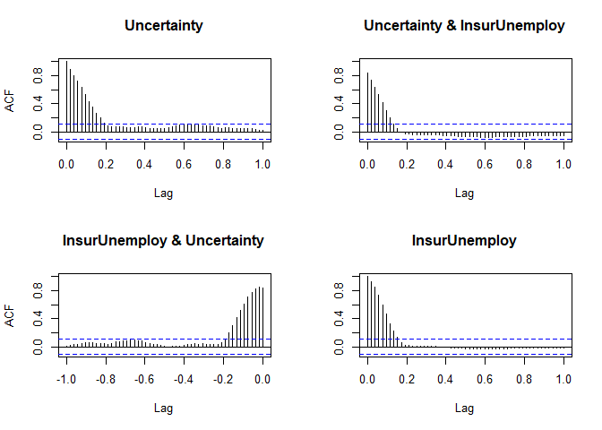<!-- -->

``` r
out.coint = ca.jo(var_data, ecdet = c("const"), K=10, season = 12, dumvar = ext[,c(1,2)])
summary(out.coint)
```

    ## 
    ## ###################### 
    ## # Johansen-Procedure # 
    ## ###################### 
    ## 
    ## Test type: maximal eigenvalue statistic (lambda max) , without linear trend and constant in cointegration 
    ## 
    ## Eigenvalues (lambda):
    ## [1] 1.180082e-01 2.451682e-02 8.401510e-18
    ## 
    ## Values of teststatistic and critical values of test:
    ## 
    ##           test 10pct  5pct  1pct
    ## r <= 1 |  8.34  7.52  9.24 12.97
    ## r = 0  | 42.19 13.75 15.67 20.20
    ## 
    ## Eigenvectors, normalised to first column:
    ## (These are the cointegration relations)
    ## 
    ##                   Uncertainty.l10 InsurUnemploy.l10  constant
    ## Uncertainty.l10           1.00000            1.0000    1.0000
    ## InsurUnemploy.l10       -41.91501          148.4157 -111.0226
    ## constant               -292.13348          104.3424  315.4008
    ## 
    ## Weights W:
    ## (This is the loading matrix)
    ## 
    ##                 Uncertainty.l10 InsurUnemploy.l10     constant
    ## Uncertainty.d       0.052380403     -0.1185074583 3.558022e-16
    ## InsurUnemploy.d     0.003276423     -0.0002503312 7.989241e-18

r = 0: test statistic greater than value at 1pct so reject
null-hypothesis of r = 0 (or no cointegration) against r != 0 at the 1%
level.

r \<= 1: test stat smaller than value at 10pct so do not reject
null-hypothesis of r \<= 1 against r \> 1 at the 1% level.

This means there is one cointegrating vector.

## \_\_\_\_\_\_\_\_\_\_GRANGER CAUSALITY\_\_\_\_\_\_\_\_\_\_

``` r
vars::causality(var, cause = c("Uncertainty"))$Granger
```

    ## 
    ##  Granger causality H0: Uncertainty do not Granger-cause InsurUnemploy
    ## 
    ## data:  VAR object var
    ## F-Test = 6.1606, df1 = 10, df2 = 624, p-value = 5.305e-09

``` r
vars::causality(var, cause = c("InsurUnemploy"))$Granger
```

    ## 
    ##  Granger causality H0: InsurUnemploy do not Granger-cause Uncertainty
    ## 
    ## data:  VAR object var
    ## F-Test = 1.9692, df1 = 10, df2 = 624, p-value = 0.03423

## \_\_\_\_\_\_\_\_\_\_IMPULSE RESPONSE\_\_\_\_\_\_\_\_\_

``` r
irf = vars::irf(var, ortho = F, n.ahead = 52)
```

png(“VAR - Impulse Response Uncertainty on InsurUnemploy.png”,
units=“in”, width=7, height=5, res=1080) dev.off()

``` r
lwd = 1.5
plot(irf$irf$Uncertainty[,"InsurUnemploy"], type = "l", ylim = c(-0.002, 0.008),
     ylab = "Insured Unemployment Rate", main = "Impulse response of Uncertainty on InsurUnemploy",
     xlab = "Weeks", lwd = lwd)
lines(irf$Lower$Uncertainty[,"InsurUnemploy"], lty = "dashed", col = "RED", lwd = lwd)
lines(irf$Upper$Uncertainty[,"InsurUnemploy"], lty = "dashed", col = "RED", lwd = lwd)
grid()
abline(h=0)
```

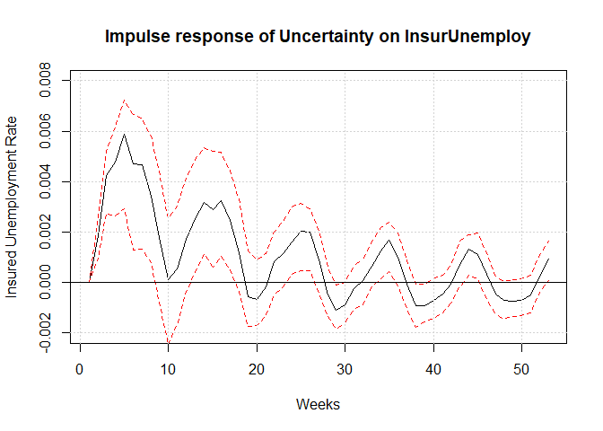<!-- -->

png(“VAR - Impulse Response InsurUnemploy on Itself.png”, units=“in”,
width=7, height=5, res=1080) dev.off()

``` r
lwd = 1.5
plot(irf$irf$InsurUnemploy[,"InsurUnemploy"], type = "l", ylim = c(-0.5, 1.3),
     ylab = "Insured Unemployment Rate (%)", main = "Impulse response of Insured Unemployment on Itself",
     xlab = "Weeks", lwd = lwd)
lines(irf$Lower$InsurUnemploy[,"InsurUnemploy"], lty = "dashed", col = "RED", lwd = lwd)
lines(irf$Upper$InsurUnemploy[,"InsurUnemploy"], lty = "dashed", col = "RED", lwd = lwd)
grid()
abline(h=0)

legend(x = 28, y = 1.3, c("Point Estimate", "95% CI (Bootstrap method)"), 
       col = c("BLACK", "RED"), lty = c(1,3), lwd = 2)
```

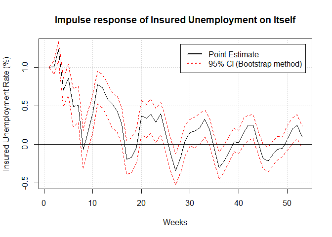<!-- -->

png(“VAR - Impulse Response InsurUnemploy on Uncertainty.png”,
units=“in”, width=7, height=5, res=1080) dev.off()

``` r
lwd = 1.5
plot(irf$irf$InsurUnemploy[,"Uncertainty"], type = "l", ylim = c(-35, 45),
     ylab = "Economic Policy Uncertainty Index", main = "Impulse response of InsurUnemploy on UncerIndex",
     xlab = "Weeks", lwd = lwd)
lines(irf$Lower$InsurUnemploy[,"Uncertainty"], lty = "dashed", col = "RED", lwd = lwd)
lines(irf$Upper$InsurUnemploy[,"Uncertainty"], lty = "dashed", col = "RED", lwd = lwd)
grid()
abline(h=0)
```

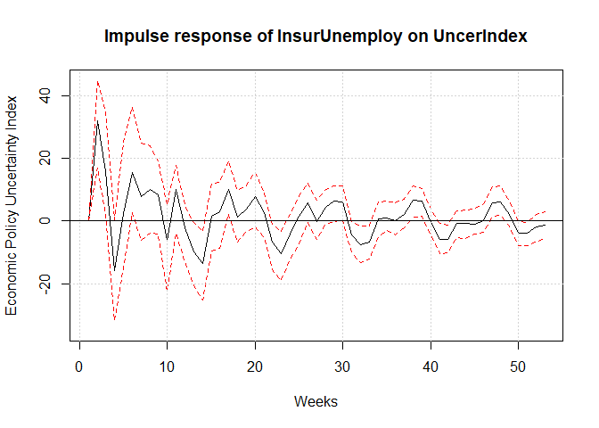<!-- -->

## \_\_\_\_\_\_\_\_\_\_DIAGNOSTICS\_\_\_\_\_\_\_\_\_

``` r
r = residuals(var)
r1 = r[,"Uncertainty"]
r2 = r[,"InsurUnemploy"]

mean1 = mean(r1); sd1 = sd(r1)
mean2 = mean(r2); sd2 = sd(r2)
```

png(“VAR - Impulse Response InsurUnemploy on Uncertainty.png”,
units=“in”, width=7, height=5, res=1080) dev.off()

``` r
par(mfrow=c(2,2))
plot(r1, type = "l", main = "Uncertainty", col = "DARKBLUE")
abline(h = mean1); abline(h = mean1 + 2*sd1, lty = "dashed"); abline(h = mean1 - 2*sd1, lty = "dashed")

plot(r2, type = "l", main = "InsurUnemploy", col = "DARKBLUE")
abline(h = mean2); abline(h = mean2 + 2*sd2, lty = "dashed"); abline(h = mean2 - 2*sd2, lty = "dashed")

plot(data$`Economic Policy Uncertainty Index`, type = "l")

plot(data$`Insured Unemployment Rate`, type = "l")
```

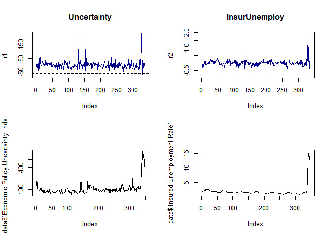<!-- -->

``` r
k = 2
a = as.numeric(names(r1[r1 > (mean1 + k*sd1) | r1 < (mean1 - k*sd1)]))
b = as.numeric(names(r2[r2 > (mean2 + k*sd2) | r2 < (mean2 - k*sd2)]))

cbind(data[a,1:2], r1[a])
```

    ##     Year Week     r1[a]
    ## 132 2016   14 199.44728
    ## 133 2016   15 -79.72603
    ## 152 2016   34 114.56563
    ## 296 2019   22  77.62489
    ## 297 2019   23  88.79598
    ## 326 2019   52 149.20801
    ## 327 2020    1 221.77516
    ## 330 2020    4 -65.93009

``` r
cbind(data[b,1:2], r2[b])
```

    ##     Year Week      r2[b]
    ## 137 2016   19  0.4520495
    ## 326 2019   52  0.6068968
    ## 327 2020    1  1.9289244
    ## 328 2020    2  0.4441354
    ## 330 2020    4 -0.5484061
    ## 331 2020    5  1.0398404
    ## 332 2020    6 -0.8713915
    ## 333 2020    7  0.6665923
    ## 336 2020   10  0.4796259

png(“VAR - Cross-Correlation Plots of Residuals.png”, units=“in”,
width=7, height=5, res=1080) dev.off()

``` r
acf(r)
```

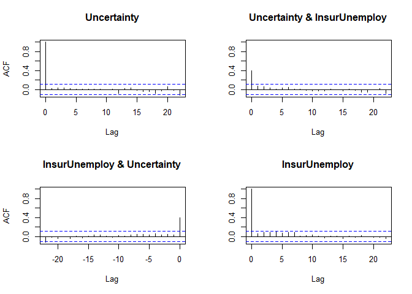<!-- -->

``` r
pacf(r)
```

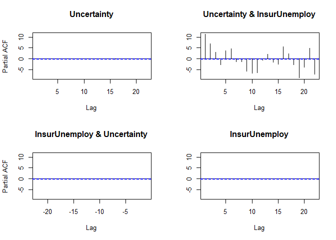<!-- -->

``` r
par(mfrow=c(1,2))
qqPlot(r1, id = F, main = "Uncertainty")
qqPlot(r2, id = F, main = "InsurUnemploy")
```

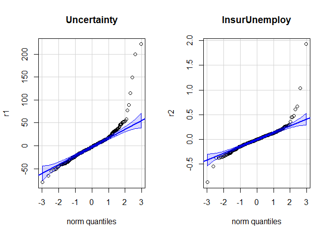<!-- -->

``` r
y1 = tail(var$y[,"Uncertainty"], nrow(var$y)-10)
y2 = tail(var$y[,"InsurUnemploy"], nrow(var$y)-10)

mape1 = mean(abs((r1/y1)))*100
mape2 = mean(abs((r2/y2)))*100

cat("MAPE1 =", mape1, "\n", "MAPE2 =", mape2)
```

    ## MAPE1 = 21.23428 
    ##  MAPE2 = 7.243418

``` r
autofit = auto.arima(series[,"InsurUnemploy"], seasonal = TRUE)

summary(autofit)
```

    ## Series: series[, "InsurUnemploy"] 
    ## ARIMA(0,0,1) with non-zero mean 
    ## 
    ## Coefficients:
    ##          ma1    mean
    ##       0.9289  1.8455
    ## s.e.  0.0170  0.1096
    ## 
    ## sigma^2 estimated as 1.127:  log likelihood=-511.6
    ## AIC=1029.2   AICc=1029.27   BIC=1040.73
    ## 
    ## Training set error measures:
    ##                         ME     RMSE       MAE       MPE     MAPE      MASE
    ## Training set -0.0005510517 1.058441 0.4192691 -12.59264 20.26942 0.7861296
    ##                   ACF1
    ## Training set 0.6981838

## \_\_\_\_\_\_\_\_\_\_FORECASTING: EXOGENEOUS\_\_\_\_\_\_\_\_\_

Forecasting exogeneous regressor

``` r
exomod1 = auto.arima(ts(ext[,1], start = c(2013,40), frequency = 52))
exomod2 = auto.arima(ts(ext[,2], start = c(2013,40), frequency = 52))
summary(exomod1)
```

    ## Series: ts(ext[, 1], start = c(2013, 40), frequency = 52) 
    ## ARIMA(2,0,0)(0,0,1)[52] with non-zero mean 
    ## 
    ## Coefficients:
    ##          ar1      ar2    sma1    mean
    ##       1.4714  -0.5339  0.1696  6.7085
    ## s.e.  0.0459   0.0463  0.0676  0.2876
    ## 
    ## sigma^2 estimated as 0.0892:  log likelihood=-73.18
    ## AIC=156.37   AICc=156.54   BIC=175.6
    ## 
    ## Training set error measures:
    ##                         ME      RMSE       MAE       MPE     MAPE      MASE
    ## Training set -0.0009474921 0.2969357 0.1893835 -0.189076 2.791225 0.3821911
    ##                     ACF1
    ## Training set -0.03495678

``` r
summary(exomod2)
```

    ## Series: ts(ext[, 2], start = c(2013, 40), frequency = 52) 
    ## ARIMA(2,0,3)(1,1,0)[52] 
    ## 
    ## Coefficients:
    ##          ar1      ar2      ma1     ma2      ma3     sar1
    ##       1.6697  -0.7368  -0.1722  0.1553  -0.1552  -0.5005
    ## s.e.  0.0884   0.0792   0.1072  0.0784   0.0741   0.0500
    ## 
    ## sigma^2 estimated as 0.007331:  log likelihood=299.07
    ## AIC=-584.13   AICc=-583.74   BIC=-558.35
    ## 
    ## Training set error measures:
    ##                      ME       RMSE        MAE       MPE     MAPE      MASE
    ## Training set 0.00192302 0.07811783 0.04194399 -9.180099 40.27634 0.2090622
    ##                     ACF1
    ## Training set 0.003782711

``` r
rx1 = residuals(exomod1)

par(mfrow=c(1,2))
acf(rx1)
pacf(rx1)
```

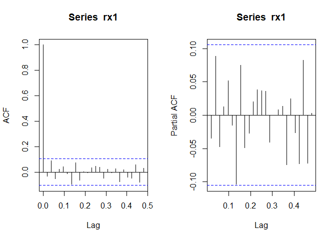<!-- -->

``` r
rx2 = residuals(exomod2)

par(mfrow=c(1,2))
acf(rx2)
pacf(rx2)
```

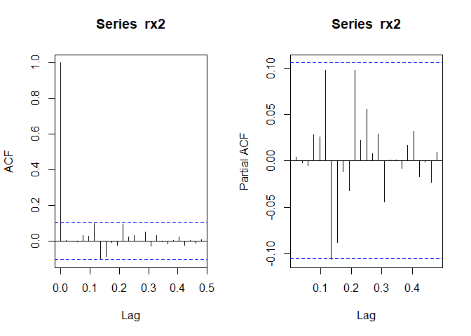<!-- -->

``` r
qqPlot(rx1, id = F)
qqPlot(rx2, id = F)
```

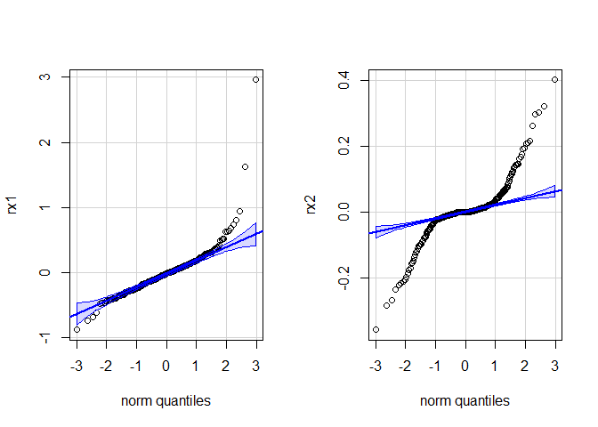<!-- -->

``` r
#Forecast depth
depth = 26
```

``` r
extpred1 = forecast(exomod1, h = depth)
extpred2 = forecast(exomod2, h = depth)
extpred = as.matrix(cbind(PneuDeath = extpred1$mean, 
                          FluDeath = extpred2$mean))

plot(extpred1, main = "PneuDeath Prediction")
```

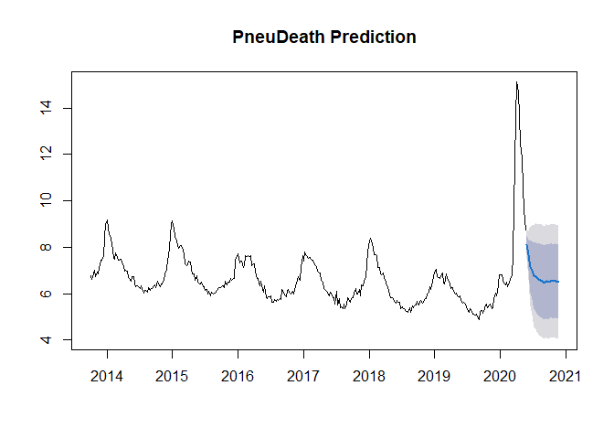<!-- -->

``` r
plot(extpred2, main = "FluDeath Prediction")
```

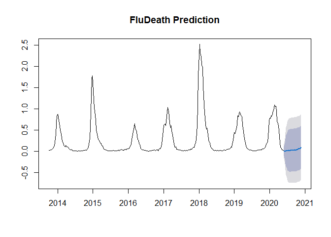<!-- -->

Using the latest values (holding situation the same)

``` r
extsame = as.matrix(cbind(PneuDeath = rep(ext[,1][nrow(ext)], depth), 
                          FluDeath = rep(ext[,2][nrow(ext)], depth)))
```

``` r
plot(ext[,c(1,2)])
```

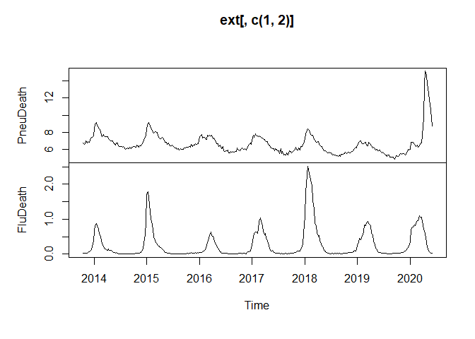<!-- -->

Using the worst value in the past 3 months (holding situation the same)

``` r
n = nrow(ext)
worst1 = max(ext[c((n-11):n),1])
worst2 = max(ext[c((n-11):n),2])

extworst = as.matrix(cbind(PneuDeath = rep(worst1, depth), 
                          FluDeath = rep(worst2, depth)))
```

``` r
worst1
```

    ## [1] 15.1113

``` r
worst2
```

    ## [1] 1.061619

``` r
data[data$`Percent of Deaths due to Pneumonia` == worst1,1:2]
```

    ## # A tibble: 1 x 2
    ##    Year  Week
    ##   <dbl> <dbl>
    ## 1  2020    15

``` r
data[data$`Percent of Deaths due to Influenza` == worst2,1:2]
```

    ## # A tibble: 1 x 2
    ##    Year  Week
    ##   <dbl> <dbl>
    ## 1  2020    11

## \_\_\_\_\_\_\_\_\_\_FORECASTING: ENDOGENEOUS\_\_\_\_\_\_\_\_\_

``` r
fore_pred = predict(var, dumvar = extpred, n.ahead = depth)
fore_same = predict(var, dumvar = extsame, n.ahead = depth)
fore_worst = predict(var, dumvar = extworst, n.ahead = depth)
```

Black line: 2020 week 1 to 2020 week 22

png(“VAR - 26-Week Ahead Forecast for Insured Unemployment Rate.png”,
units=“in”, width=7, height=5, res=1080) dev.off()

``` r
lwd = 1.5; PIlty = "dotted"; past = 22
existing = tail(c(series[,"InsurUnemploy"],fore_same$fcst$InsurUnemploy[,"fcst"][1]), n=past)
n = length(existing) + 1

plot(as.vector(existing), type = "l", ylim = c(0,30), xlim = c(0,past+depth),
     ylab = "Insured Unemployment Rate (%)", xlab = "Weeks", lwd = lwd, col = "BLACK", axes = F,
     main = "26-Week Ahead Forecasts of Insured Unemployment Rate")

horizontal = seq(0,30, by = 5); vertical = seq(0,past+depth, by = (past+depth)/6)
abline(h = horizontal, v = vertical, col = "GREY", lty = "dotted")
axis(side = 2, at = horizontal)
axis(side = 1, at = vertical, labels = F)
text(x=vertical,  par("usr")[3], 
     labels = c("2020-W1", "2020-W9", "2020-W17", "2020-W25", 
                "2020-W33", "2020-W41", "2020-W49"), 
     srt = 0, pos = 1, xpd = T, cex = 0.75, offset = 1)

lines(x = n:(n+depth-1), y=fore_same$fcst$InsurUnemploy[,"fcst"], col = "DARKBLUE", lwd = lwd)     
lines(x = n:(n+depth-1), y=fore_same$fcst$InsurUnemploy[,"upper"], lty = PIlty, col = "BLUE", lwd = lwd)
lines(x = n:(n+depth-1), y=fore_same$fcst$InsurUnemploy[,"lower"], lty = PIlty, col = "BLUE", lwd = lwd)

lines(x = n:(n+depth-1), y=fore_worst$fcst$InsurUnemploy[,"fcst"], col = "DARKRED", lwd = lwd)
lines(x = n:(n+depth-1), y=fore_worst$fcst$InsurUnemploy[,"upper"], lty = PIlty, col = "RED", lwd = lwd)
lines(x = n:(n+depth-1), y=fore_worst$fcst$InsurUnemploy[,"lower"], lty = PIlty, col = "RED", lwd = lwd)

#lines(x = n:(n+depth-1), y=fore_pred$fcst$InsurUnemploy[,"fcst"], col = "DARKGREEN", lwd = lwd)
#lines(x = n:(n+depth-1), y=fore_pred$fcst$InsurUnemploy[,"upper"], lty = PIlty, col = "GREEN", lwd = lwd)
#lines(x = n:(n+depth-1), y=fore_pred$fcst$InsurUnemploy[,"lower"], lty = PIlty, col = "GREEN", lwd = lwd)

legend(x = 0, y = 30, c("Worst-case", "Unchanged"), col = c("DARKRED", "DARKBLUE"), lty = c(1,1), lwd = 2,
       bg = "WHITE", title = "Forecasts", text.font=2, cex = 0.85)
```

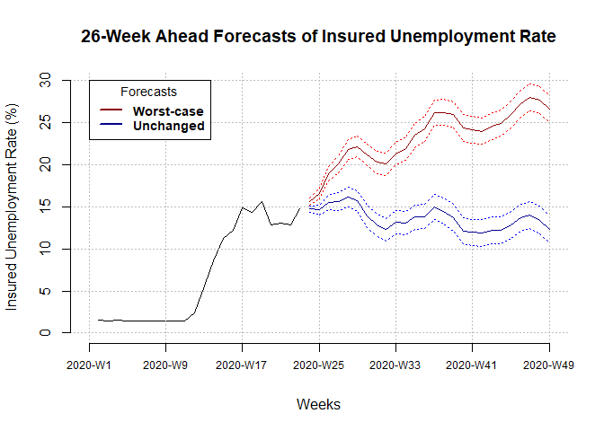<!-- -->
